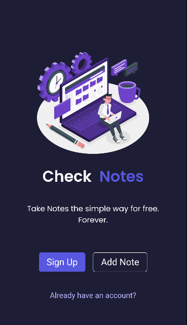

# Check Note

Check Notes is a notes app to store notes and add labels, colors and filters to them for easy access. User can create notes with different styles and archive or delete them based upon usage. It makes tracking your tasks really easy.

---

## Contains

- [Home](https://checkmate-note.netlify.app/index.html)
- [Notes](https://checkmate-note.netlify.app/notes/notes.html)
- [Label](https://checkmate-note.netlify.app/label/label.html)
- [Archive](https://checkmate-note.netlify.app/archive/archive.html)
- [Delete](https://checkmate-note.netlify.app/delete/delete.html)

---

## Built With

- HTML
- CSS
- Javascript
- [Checkmate UI](https://checkmate-ui.netlify.app/)
- Ionicons

---

## Desktop Version

## Mobile Version

---

## 👨‍💻 Connect with me

